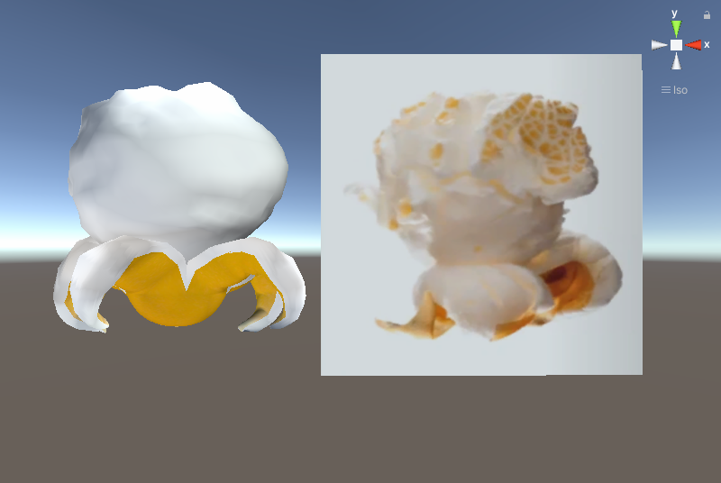
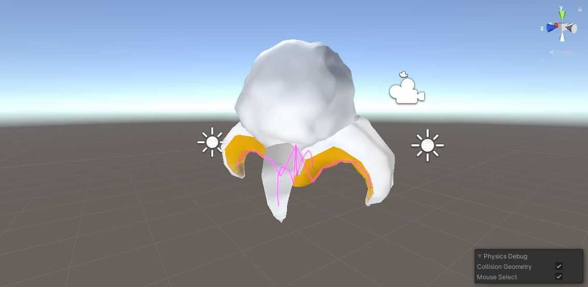
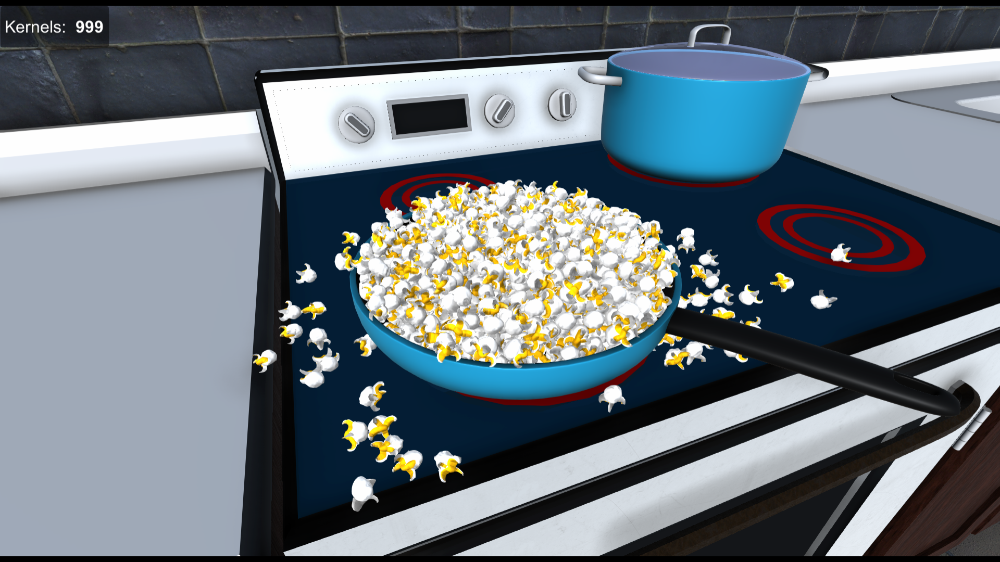

## Description:

Application that simmulates the expansion of a popcorn kernel. Made using Unity Engine.

The program takes a 3D model of a popcorn kernel and transforms it into popcorn. This is done in multiple stages:
- Slicing: The kernel is sliced using cutting planes.
- Puffing: The white part of the popcorn is added between the slices.
- Rigging: The 3D model is given a skeleton so it can be animated.
- Adding collision: Rigid bodies are added to the 3D model so it can interact with other physics objects from the scene.
- Animating: An animation that simulates the pop is added and played.

## Screenshots:

## References

Ezy-Slice: <https://github.com/DavidArayan/ezy-slice>\
Kernel Model: <https://sketchfab.com/3d-models/corn-kernel-284db06b8d094a6382c62913083335d7>\
Kitchen Model: <https://sketchfab.com/3d-models/kitchen-a7403be7a6cf4251b9b6fec4420e1b98>\
Pot Models: <https://sketchfab.com/3d-models/pots-and-pans-kitchen-set-8fcb576caba0460b903a562e889a37b3>\
Popcorn Machine Model: <https://sketchfab.com/3d-models/popcorn-machine-0dac52e077044a5997610dfe6a905331>
